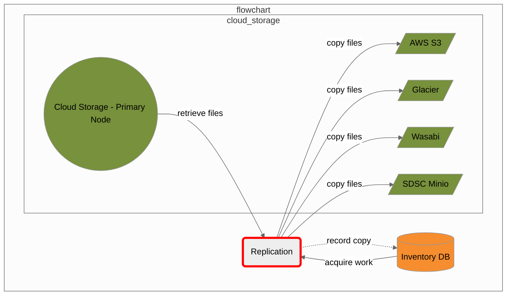

# Merritt Replication Service

This microservice is part of the [Merritt Preservation System](https://github.com/CDLUC3/mrt-doc).

## Purpose

This microservice performs ensures that every new file added to a primary cloud storage node within 
the Merritt Preservation System is replicated to secondary cloud storage nodes.

The work that this service performs is determined by querying the Merritt Inventory Database.

## Original System Specifications
- [Merritt Replication Service](https://github.com/CDLUC3/mrt-doc/blob/main/doc/Merritt-replication-service-latest.pdf)

## Component Diagram

## Dependencies

This code depends on the following Merritt Libraries.
- [Merritt Cloud API](https://github.com/CDLUC3/mrt-cloud)
- [Merritt Core Library](https://github.com/CDLUC3/mrt-core2)

## For external audiences
This code is not intended to be run apart from the Merritt Preservation System.

See [Merritt Docker](https://github.com/CDLUC3/merritt-docker) for a description of how to build a test instnce of Merritt.

## Build instructions
This code is deployed as a war file. The war file is built on a Jenkins server.

## Test instructions

## Internal Links

### Deployment and Operations at CDL

https://github.com/CDLUC3/mrt-doc-private/blob/main/uc3-mrt-replic.md
